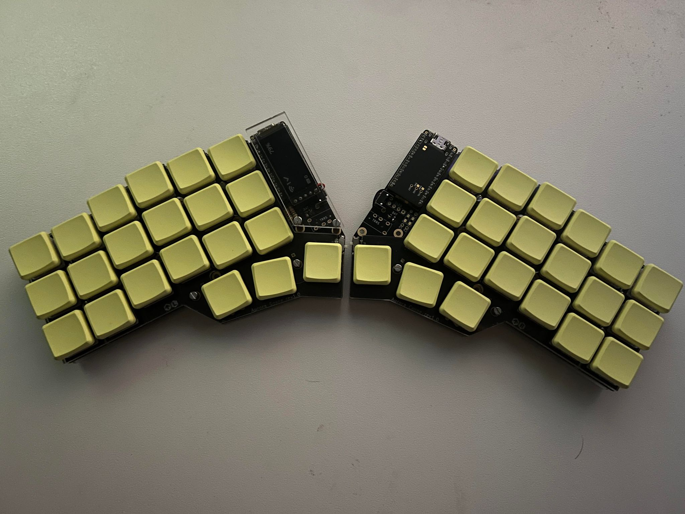

My Aurora Corne Split KB

# Installation

1. Clone repo.
2. Setup ZMK toolchain
3. cd into zmk repo (clone first) `zmk/app`
4. Run the command below (replace absolute path, shall point to this repo `zmk-config/config`). Also choose between left/right.  
   `west build --pristine -b nice_nano_v2 -- -DSHIELD=splitkb_aurora_corne_<left/right> -DZMK_CONFIG="<ABSOLUTE-PATH>/zmk-config/config"`

## Encountered issues

Not renaming the `.keymap` & `.conf` files. Results in the "default" keymap being written.  
Also the absolute path **must** contain forward slahes. Backslashes will result in `Invalid character escape '\U'`.

## Components

Coloured Blank MBK Choc Low Profile Keycaps
Pastel Yellow (0131U) / 1 keycap

Coloured Blank MBK Choc Low Profile Keycaps - Pastel Yellow (0131U) / 10 keycaps
Pastel Yellow (0131U) / 10 keycaps

Aurora Corne PCB Kit - Choc/MX Hand solder
Choc/MX Hand solder

nice!view MIP display

Low Profile Socket Strip / 4 positions - Set of 2
Set of 2

nice!nano Wireless Microcontroller - 2.0

Wireless Controller Expansion Bundle

Mill Max Low Profile Sockets - Set of Sockets with Headers
Set of Sockets with Headers

Aurora Corne Low Profile Case - Top Plate / Clear Acrylic / Set of 2
Top Plate / Clear Acrylic / Set of 2

Aurora Low Profile Case Hardware Kit

Aurora Corne Low Profile Case - Bottom Plate / Frosted Acrylic / Set of 2
Bottom Plate / Frosted Acrylic / Set of 2

Aurora Corne Low Profile Case - OLED Cover / Clear / Set of 2
OLED Cover / Clear / Set of 2

Kailh Low Profile Choc Switches - Crystal Red (linear / 35gf) / 10 switches
Crystal Red (linear / 35gf) / 10 switches